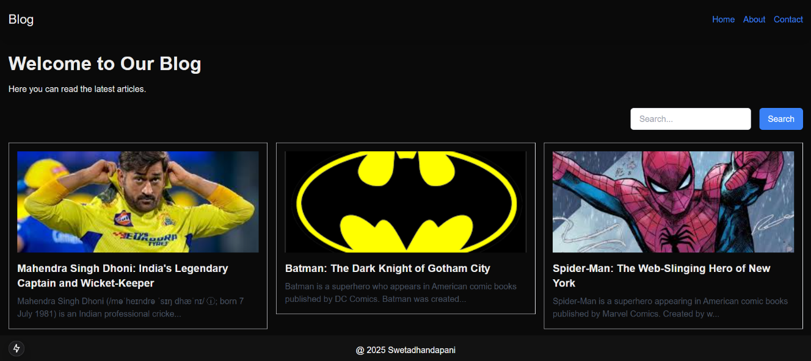
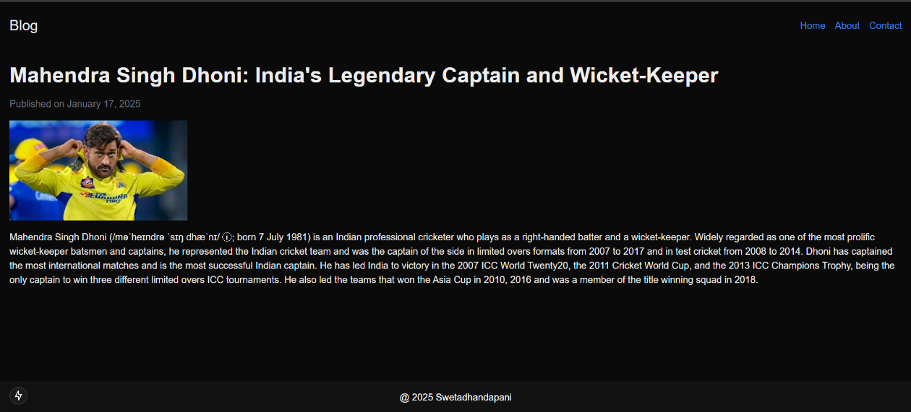

**Mini Blog Using Next.js -- Project Overview**

The **Mini Blog using Next.js** is a dynamic, modern web application
designed to demonstrate core features of Next.js, including server-side
rendering, API routing, and seamless integration with a NoSQL database
like MongoDB. This project is perfect for showcasing the capabilities of
Next.js and creating a fully functional, lightweight blogging platform.

**Features and Functionality**

1.  **Dynamic Blog Post Listings**\
    The home page displays a list of blog posts fetched dynamically from
    a backend API. Each post is shown with a title, description snippet,
    and a link to view detailed information. Pagination or infinite
    scrolling can also be implemented to enhance usability.

2.  **Individual Post Details**\
    Each blog post has its dedicated details page, accessed through
    dynamic routing. This page displays the post title, content, an
    image, and metadata such as the publication date. The information is
    fetched from the backend based on the unique ID of the post.

3.  **Responsive Design**\
    Built with modern CSS frameworks like Tailwind CSS, the application
    ensures a responsive layout that works seamlessly across devices.
    The clean and minimalist design prioritizes user experience.

4.  **API Integration**\
    The project features a backend API for managing blog posts and user
    inquiries:

    -   **Get all posts**: Fetch a list of blog posts.

    -   **Get post by ID**: Fetch detailed information for a specific
        post.

    -   **Contact form submission**: Capture and process user inquiries
        via a dedicated API endpoint.

5.  **MongoDB Integration**\
    MongoDB is used as the primary database for storing blog post data
    and contact form submissions. The application demonstrates
    connecting to the database, defining a schema using Mongoose, and
    performing CRUD operations.

6.  **SEO and Metadata Management**\
    The project utilizes Next.js metadata features to dynamically update
    page titles and meta descriptions based on the content being
    displayed. This improves search engine visibility and enhances user
    experience.

> Fig 1. The Blog Hub

**Learning Objectives**

The **Mini Blog using Next.js** project serves as an excellent learning
resource for web developers. It covers:

-   **Dynamic Routing**: Learn how to implement routes with dynamic
    segments to handle varying content.

-   **Server-Side Rendering (SSR)**: Understand how Next.js pre-renders
    pages on the server for better performance and SEO.

-   **Client-Side Fetching**: Explore how to fetch data using React
    hooks like useEffect.

-   **MongoDB Integration**: Gain practical experience in working with
    databases, defining schemas, and performing queries.

-   **API Development**: Learn to create API routes in Next.js and
    handle incoming requests for data.

-   **Form Handling**: Build and integrate a contact form with a backend
    API to collect user input.

**Fig 2**. The Blog Post

**Use Cases**

This project is suitable for:

-   Aspiring developers seeking hands-on experience with Next.js and
    backend integration.

-   Bloggers looking to build a simple yet effective platform to publish
    and manage content.

-   Startups and small businesses requiring a basic blogging platform to
    share updates and news.

-   Developers aiming to extend their skills by adding features such as
    authentication, search, or admin dashboards.

**Conclusion**

The **Mini Blog using Next.js** is not just a project---it's a hands-on
journey into modern web development. By building this application,
developers can grasp the essentials of Next.js, backend integration, and
creating feature-rich, responsive web applications. Whether used as a
learning tool or a starting point for a real-world blog, this project
offers a comprehensive experience in building scalable, high-performance
web apps.
